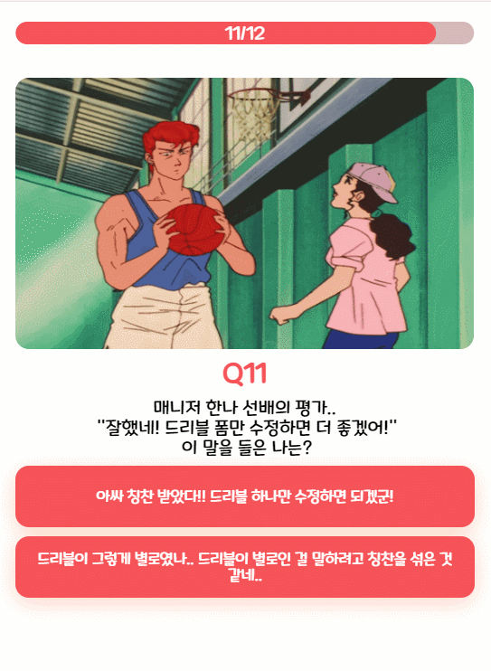

<h1 align="center">Welcome to Slamdunk Test 👋</h1>

<br>

### 🏠 [HomePage](https://slamdunk-test.site/)  

<br>

## :page_with_curl: ​Description

> 나는 슬램덩크의 무슨 캐릭터일까?
<br>

### 개요

- 인기 만화 슬램덩크의 캐릭터를 MBTI와 매칭하여 진행하는 성격테스트

<br>

### 주요기능

- 폰트, 이미지등의 로딩을 기다리는 **useLoading** 커스텀 훅 제작, 이미지 배열을 받아 **promise.all로** 병렬처리
- 각 엘리먼트를 순차적으로 애니메이트하는 유틸함수 제작
- 모든 문항 컴포넌트를 로드하지않고, 한 개의 문항 컴포넌트만을 렌더링하여 **초기 렌더링 속도 향상**
- **will change** 속성을 통한 애니메이션 속도 최적화

<br>


## :mag: Overview

<br>

### Main page


<br>

### Question & Result page



<br>

<br>

<br>

## :wrench: ​Tech Stack

- NextJS  `13.1.5`
- ReactJS `18.2.0`
- Styled-components `5.3.6`
- Typescript `4.9.4`


<br>
<br>

## :runner: Steps to run

```bash
$ npm install 
$ npm run dev
```


